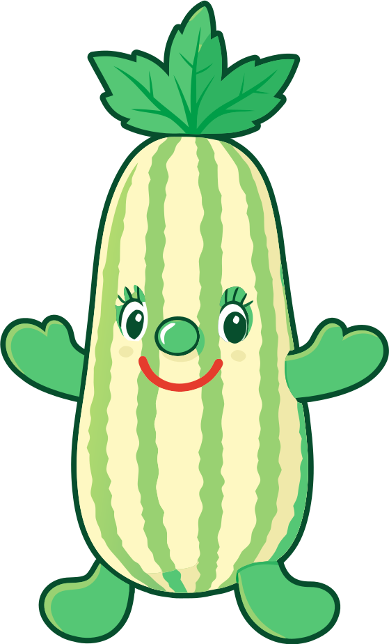

::: mascot


My beloved zucchini
:::

::: quote
*La perfection est atteinte, non pas lorsqu'il n'y a plus rien à ajouter, mais lorsqu'il n'y a plus rien à retirer.*

[*Perfection is achieved, not when there is nothing more to add, but when there is nothing left to take away.*]{.translation}
[— Antoine de Saint-Exupéry]{.author}
:::

I am a PhD student in **causality** at the Laboratoire de Mathématiques et Modélisation d'Évry (LaMME), Université Paris-Saclay, starting in October 2026 under the supervision of [Christophe Ambroise](https://ambroise.cloud), [Gilles Blanchard](https://www.imo.universite-paris-saclay.fr/~blanchard/) and [Pierre Humbert](https://pierrehmbt.github.io). I graduated first of my Master in Mathematics and Artificial Intelligence at Université Paris-Saclay. My interests lie at the intersection of causal discovery, optimal transport, conformal prediction, statistical fairness and differential privacy. I develop theoretical foundations and practical algorithms, with a particular taste for highly optimized `Python`.

Beyond my research, I try to stay grounded through more tangible activities. I travel whenever possible, spend time in the humbling presence of the Alps, play the piano regularly, and enjoy gardening.

I'm also interested in macrophotography, which consists in taking close-up photos of insects, spiders, and small plants as subjects that are often overlooked or even frowned upon. What draws me to it is the idea of slowing down and really paying attention to these small forms of life, and trying to show them in a way that feels fair to them.



```{=html}
<script src="assets/vendor/gsap.min.js" defer></script>
<script src="assets/mascot.js" defer></script>
```
